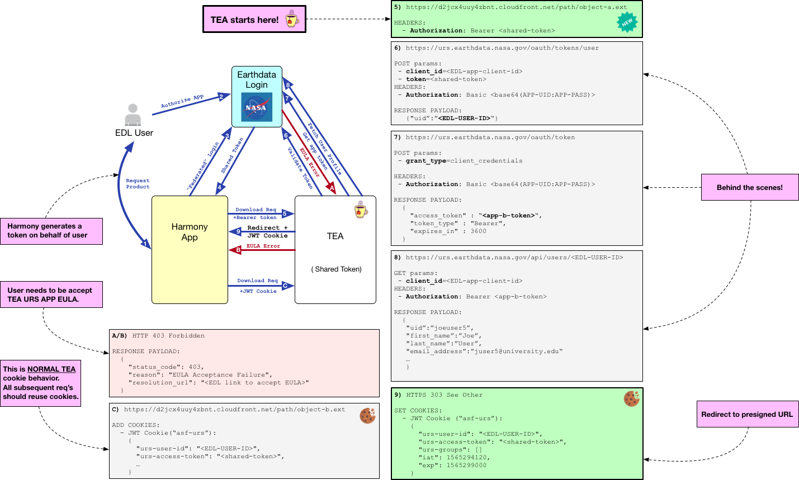

# Configuration

## Bucket Mapping

At the heart of TEA is the concept of the Bucket Map. This YAML file tells TEA how to
map URLs to buckets and how to control access to data in buckets. Mapping depths are
arbitrary and dynamically account for object path prefixes. Bucket maps are case
sensitive!

When working with a bucket map, it is important to remember that bucket names are
relative to the optional `bucket prefix` TEA parameter. If a `bucket prefix` is
supplied, that value is prepended to any bucket name. This optional feature is intended
to allow bucket maps to be used in multiple maturities (e.g. Sandbox, SIT, UAT, Prod)
where bucket names are consistent across maturities given a specific bucket prefix.

Assume the following bucket map:

```yaml
MAP:
  path1: bucket-path-1

  path2:
    path2a: bucket-path-2a
    path2b: bucket-path-2b

  path3:
    path3a:
      path3ai: bucket-path-3ai
```

You can derive the following object -> URL mappings:
```
s3://bucket-path-1/object.txt           => https://[APP-BASE-URL]/path1/object.txt
s3://bucket-path-2a/file.ext            => https://[APP-BASE-URL]/path2/path2a/file.ext
s3://bucket-path-2b/low-res/browse.jpg  => https://[APP-BASE-URL]/path2/path2b/low-res/browse.jpg
s3://bucket-path-3ai/some-product.h5    => https://[APP-BASE-URL]/path3/path3a/path3ai/some-product.h5
```

It is **NOT** possible to have distribution at the app root. That is,
`s3://bucket-path-1/object.txt` cannot be configured to be distributed at
`https://[APP-BASE-URL]/object.txt`.

### Custom Headers

Custom HTTP response headers can be added to bucket mappings:

```yaml
MAP:
  path1:
      bucket: bucket-path-1
      headers:
        Content-Type: "text/plain"
```

### EDL Access Control

By default, all buckets are assumed to require a user to log into Earthdata Login to
download data. However, there are two options to change that behavior

#### Public Buckets

Buckets can be made public by adding a `PUBLIC_BUCKETS` block:

```yaml
MAP:
   browse: browse-bucket

PUBLIC_BUCKETS:
   browse-bucket:  "Internal only Comment about browse being public"
```

In the above example, accessing `https://[APP-BASE-URL]/browse/some-browse-image.jpg`
would not require EDL authentication, however, if a user was already logged in, the
downloads would be tagged with that users EDL User ID.

#### Private Buckets

TEA download can also be restricted to users who belonging to an EDL Application
User Group. This allows App and Data owners to specify a discrete list of specially
approved users who can download data.

```yaml
MAP:
   pre-commission: pre-comission-data-bucket

PRIVATE_BUCKETS:
   pre-commission-data-bucket:
     - internal_users
     - external_team
```

In the example above, TEA will ensure that a user attempt to download
`https://[APP-BASE-URL]/pre-commission/not-yet-public.zip` belongs to **either**
the App User Group `internal_users` or `external_team`. Users who are not in one or
both of those groups will not be granted a download.

#### Public and Private Prefixes

In addition you specifying whole buckets as Public or Private, you can also use
object prefixing to control access:

```yaml
MAP:
    data-path: data-bucket

PUBLIC_BUCKETS:
    data-bucket/browse/: "Browse image"

PRIVATE_BUCKETS:
    data-bucket/:
      - internal_users
      - external_team
```

In the above example, while access to data in `data-bucket` requires EDL App
group access to one of the specified groups, accessing an object with the
prefix `browse/` will not require any auth.

TEA will always check the rules from most deeply nested to most shallow. So
for example, in this bucket map:

```yaml
MAP:
    data-path: data-bucket

PUBLIC_BUCKETS:
    data-bucket/external/public/: "Browse image"

PRIVATE_BUCKETS:
    data-bucket/:
      - internal_users
    data-bucket/external/:
      - internal_users
      - external_team
```

Any data in the prefix `external/public/` will be public, data in the prefix
`external/` but not in the prefix `external/public/` will be available to users
in either of the defined EDL App groups, and everything else in the bucket will
be available to users in the `internal_users` group only.

##### S3 Direct Access Compatibility

Some access configurations supported by the standard HTTP methods are not allowed when S3 direct access is enabled. Of note:

1. The first prefix in the bucket map will need to be set to the most restrictive access level and subsequent prefixes must have access levels that become successively more open. This is due to a limitation with how IAM policies work (For more information, see [S3 direct access](#s3-direct-access)).
2. Public buckets will require EDL authentication for S3 direct access. e.g. "Browse image"

All of the bucket maps shown above are compatible with S3 direct access; however, long time users of
TEA might recognize the following configuration example from previous versions which will be rejected when S3 direct access is enabled.

Bad Example:
```yaml
MAP:
    data-path: data-bucket

PUBLIC_BUCKETS:
    data-bucket/browse/: "Browse image"

PRIVATE_BUCKETS:
    # Since no permission is specified for `data-bucket/`, the default is used
    # which allows access to any authenticated user. Therefore, adding a
    # prefix `pre-commission-data/` that is more restrictive will break IAM
    # compatibility.
    data-bucket/pre-commission-data/:
      - internal_users
      - external_team
```

To fix this, the bucket map could be modified as follows:

Good Example:
```yaml
MAP:
    data-path: data-bucket

PUBLIC_BUCKETS:
    data-bucket/browse/: "Browse image"

PRIVATE_BUCKETS:
    data-bucket/:
      - internal_users
      - external_team
    # The following rule is redundant, but might not be in the presence of
    # other rules.
    data-bucket/pre-commission-data/:
      - internal_users
      - external_team
```

#### S3 Direct Access

TEA can be deployed with an `/s3credentials` endpoint (See
[Enabling S3 direct access](deploying.md#enabling-s3-direct-access)) for
facilitating S3 direct access. Credentials handed out over this endpoint will
have both `s3:ListBucket` and `s3:GetObject` permissions for in-region requests
to prefixes configured in the bucket map.

For example:

```yaml
MAP:
   data-path: data-bucket

PUBLIC_BUCKETS:
   data-bucket/browse/: "Browse image"

PRIVATE_BUCKETS:
   data-bucket/pre-commission-data/:
     - internal_users
     - external_team
```

Using this bucket map, the `/s3credentials` endpoint would return credentials
allowing in-region access to any objects in `data-bucket` EXCEPT objects that
have the `pre-commission-data/` prefix to any logged in user. Any user in the
`internal_users` or `external_team` groups would be able to use their
credentials to access all data in the bucket.

## Custom Templating

You may optionally create your own [jinja2](http://jinja.pocoo.org/docs/2.10/) html
templates. If no custom templates are supplied in the `HtmlTemplateDir` subdirectory
of the `ConfigBucket` bucket, ultra-generic (and a little annoying!)
[default templates](https://github.com/asfadmin/thin-egress-app/tree/main/lambda/templates)
are used.

**base.html**
This is the base template.

Blocks:

  * `pagetitle`: Gets inserted inside the `<title></title>` element
  * `content`: Content payload fed into the template.

**root.html**
Child template. Gets called by `/` and `/logout` for 200 responses.

Variables:

  * `title`: page title
  * `URS_URL`: used to make the login link
  * `STAGE`: used to make a URL back to the egress app
  * `profile`: in the default template, `profile.first_name` and `profile.last_name` are used to greet a logged-in user. The entire profile dict is available to the template.
  * `contentstring`: any text can go here

**error.html**
Child template that gets called when various 400 type errors happen.

Variables:

  * `title`: page title
  * `status_code`: http status code goes here
  * `contentstring`: any text can go here

**profile.html**
Child template that displays profile info. Only used for debugging in dev.

## Shared Token Support

TEA can accept a shared [EDL Token](https://urs.earthdata.nasa.gov/documentation/for_users/user_token)
as an Authorization (Bearer Token) method. To enable this behavior, EDL Apps
(Service + TEA) must belong to a shared EDL App Group. Processing a
shared token is temporally expensive. After the initial request, subsequent
Service->TEA data requests should reuse cookies. EULA enforcement is
preserved with shared tokens.



## Using custom domain names

There is a process by which you can request an Alternate Domain name to your
CloudFront endpoint. If you do this, you'll need to update the `DomainName`,
`CookieName`, and `DomainCertArn` parameters of your
[TEA Deploment](deploying.md#all-parameters).

## Updating configuration of a live TEA

If the bucket map is updated, because of caching it can take quite some time before TEA loads it.
If you would like to force TEA to load the new configs immediately, invoke the bumper lambda:
```bash
aws lambda invoke --function-name="${STACK_NAME}-BumperLambda" output.txt
```
