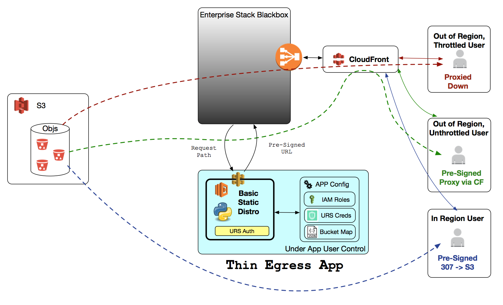
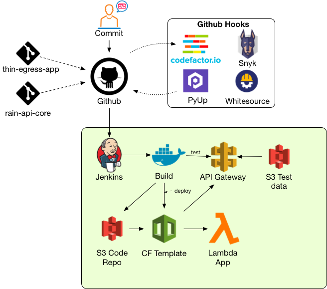

## System Architecture

TEA is a [Python Chalice](https://github.com/aws/chalice)
application that leverages AWS Lambda and API Gateway to create Pre-signed
S3 URLs to facilitate user downloads over https via CloudFront.

### Dynamic In-Region IP CIDR Updates

TEA deploys a Lambda, triggered by a subscription to the SNS Topic
`arn::aws:sns:us-east-1:806199016981:AmazonIpSpaceChanged`, which downloads
the AWS Provided
[ip-ranges.json](https://ip-ranges.amazonaws.com/ip-ranges.json)
file, parses out the IP CIDRs for the deploy region, and automatically
updates the In-Region IAM Role's Policy Document `condition` block.

This lambda is defined in
[update_lambda.py](https://github.com/asfadmin/thin-egress-app/blob/master/lambda/update_lambda.py)

## Build Process

### Code Quality

TEA leverages several open source platforms along with mandatory peer code
review to help ensure the code base is clean, stable, and secure.

#### Linting

CodeFactor.io github integrations provide merge request blocking based on
appropriate levels of code linting.

#### CVE

PyUp, Snyk and Whitesource all provide Common Vulnerabilities and Exposures
(CVE) Analysis. Emergent CVE fixes are automatically pushed to the TEA repo
as pull requests and merged into the repo as soon as possible.

#### Static Code Analysis

CodeFactor.io and Whitesource provide merge request block based on Static
Code Analysis to help ensure our code is secure and safe to run.

## External Integrations

TEA cannot really operate in a vacuum. TEA is part of what might be considered
the Earthdata ecosystem.

### Cumulus

TEA can be considered the "official" distribution application of Cumulus, and
while there is a symbiotic relationship, TEA is an add-on to cumulus rather than
an extension. We suggest utilizing the applicable Cumulus documentation for
tightly coupled TEA+Cumulus deployments.

### EDL

The Earthdata Login OAUTH service is a requirement for distributing data where
user activity tracking and reporting is required. Before deploying TEA, it is
important to have access to, or
[create a new EDL Application](https://urs.earthdata.nasa.gov/documentation/for_integrators/how_to_register_an_app).
Creating and administrating an EDL Application requires the EDL App Admin role,
which must be requested through the feedback modal in the Earthdata login header
menu.

### EDC

While TEA can be deployed outside of the Earthdata Cloud, it is designed and
intended to be used within the Earthdata Cloud environment. While we assume
you'll be deploying to the EDC, we cannot provide assistance in setting up or
configuring access to EDC. However, when there are steps or considerations that
are required for integration into EDC, we will help ensure you have all the
information you need to do the right thing.
